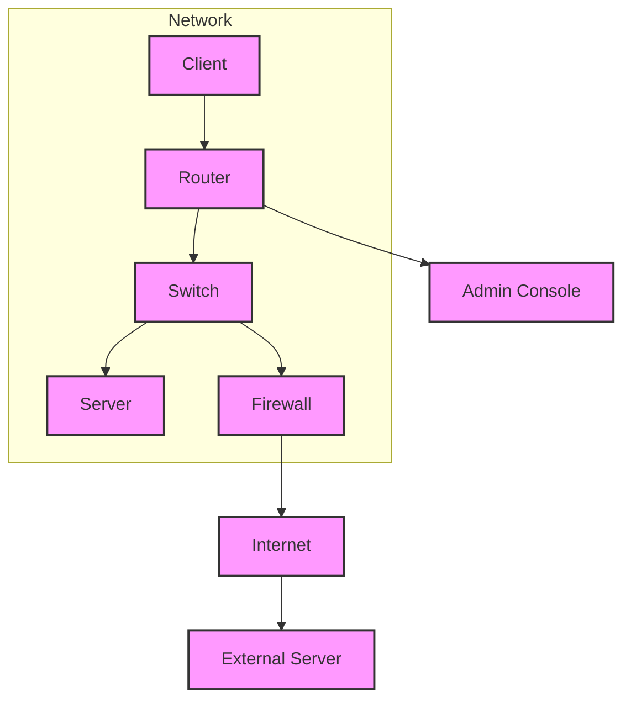

# netclab-chart

A Helm chart for deploying containerized network topologies, using [Multus CNI](https://github.com/k8snetworkplumbingwg/multus-cni) for multi-interface support.
<br><br>
This chart allows you to deploy lab routers, hosts and traffic/protocol generators.
<br>
It renders the necessary `ConfigMap`, `Pod`, and `NetworkAttachmentDefinition` objects from structured `values.yaml`.
<br><br>
It can be used for labs, tests, CI.

## Prerequisites

Before installing `netclab-chart`, ensure the following are present:

- Kubernetes
- Helm
- [Multus CNI](https://github.com/k8snetworkplumbingwg/multus-cni) installed and running

### Install Multus CNI (if not already installed)

```bash
kubectl apply -f https://raw.githubusercontent.com/k8snetworkplumbingwg/multus-cni/master/deployments/multus-daemonset-thick.yml
```

## Installation

```bash
helm search hub netclab --list-repo-url
helm repo add netclab https://mbakalarski.github.io/netclab-chart
helm repo update
helm search repo netclab
helm install netclab netclab/netclab
```

## Configuration

Edit `values.yaml` to define your network.

```yaml
topology:
  default_network:
    name: b0
    subnet: 10.10.0.0/24
    gateway: 10.10.0.254
  networks:
  - name: b1
  - name: b2
  - name: b3
  - name: b4
  - name: b5
  nodes:
  - name: otg
    type: ixia-c
    interfaces:
    - name: eth1
      network: b3
    - name: eth2
      network: b4
    - name: eth3
      network: b5
  - name: srl01
    type: srlinux
    interfaces:
    - name: e1-1
      network: b1
    - name: e1-2
      network: b2
    - name: e1-3
      network: b3
  - name: srl02
    type: srlinux
    interfaces:
    - name: e1-1
      network: b1
    - name: e1-2
      network: b2
    - name: e1-3
      network: b4
  - name: linux1
    type: linux
    interfaces:
    - name: eth1
      network: b3
  - name: linux2
    type: linux
    interfaces:
    - name: eth1
      network: b4
```

```mermaid
  info
```



## Upgrade or Reinstall

To upgrade the release after making changes:
```bash
helm upgrade netclab netclab/netclab --values values.yaml
```
or:
```bash
helm uninstall netclab
helm install netclab netclab/netclab --values values.yaml
```

## Future Plans

- Replace static Helm templates with dynamic controller logic
- Define a CRD for Topology to enable programmable lab descriptions
- Add support for additional containerized router platforms
- Add Support for multi-node cluster

## Contributing

Feel free to open issues or submit PRs on:
https://github.com/mbakalarski/netclab-chart
