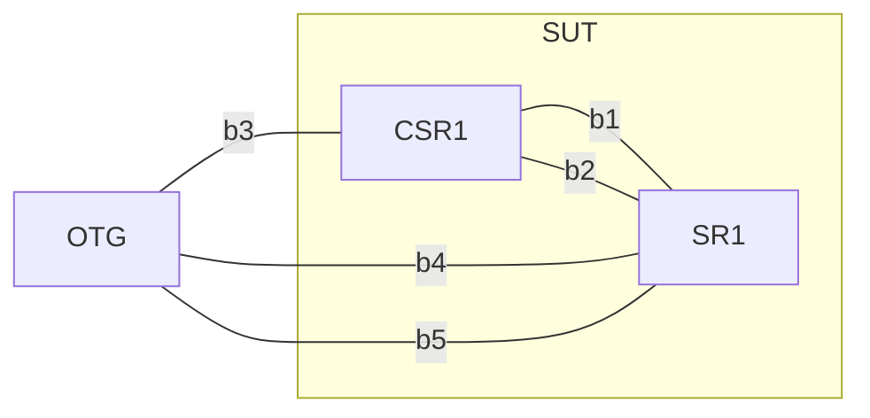

# netclab-chart

**netclab-chart**  is a Helm chart that deploys network topologies onto Kubernetes.
It leverages [Multus CNI](https://github.com/k8snetworkplumbingwg/multus-cni) to support multi-interface containers and renders the required Kubernetes resources (e.g., ConfigMaps, Pods, NetworkAttachmentDefinitions) from a structured YAML-based topology definition.
<br>
Use it to quickly bring up containerized network labs for testing, automation, development, and education — all within your cluster.

## Use Cases

**netclab-chart** enables rapid deployment of containerized network topologies on Kubernetes. Key use cases include:
- **Network design validation**: Validate HLD/LLD configurations and device behaviors before committing designs.
- **Test automation**: Develop and verify automation scripts for traffic/protocol generators or analyzers (e.g., APIs of IxNetwork) — effectively unit testing your test logic.
- **Image validation**: Test new versions of NOS (virtual or HW-aligned) to verify feature support and functionality.
- **Training & certification prep**: Practice CLI, protocols, and topologies in a safe, repeatable lab — ideal for students and professionals preparing for vendor certifications.

Have a use case we didn’t list? Open an issue or share your ideas — contributions are welcome!

## Prerequisites

Before installing `netclab-chart`, ensure the following are present:

- Kubernetes with [Multus CNI](https://github.com/k8snetworkplumbingwg/multus-cni) installed and running
- [Helm](https://helm.sh/docs/intro/install/)
- and if VM in topology is planned add [KubeVirt](https://github.com/kubevirt/kubevirt) + [CDI](https://github.com/kubevirt/containerized-data-importer)

#### quickstart for [Multus CNI](https://github.com/k8snetworkplumbingwg/multus-cni):

```bash
kubectl apply -f https://raw.githubusercontent.com/k8snetworkplumbingwg/multus-cni/master/deployments/multus-daemonset-thick.yml
```

#### quickstart for [KubeVirt](https://github.com/kubevirt/kubevirt) and [CDI](https://github.com/kubevirt/containerized-data-importer):

```bash
export VERSION=$(curl -s https://storage.googleapis.com/kubevirt-prow/release/kubevirt/kubevirt/stable.txt)
kubectl create -f "https://github.com/kubevirt/kubevirt/releases/download/${VERSION}/kubevirt-operator.yaml"
kubectl create -f "https://github.com/kubevirt/kubevirt/releases/download/${VERSION}/kubevirt-cr.yaml"

export VERSION=$(curl -s https://api.github.com/repos/kubevirt/containerized-data-importer/releases/latest | grep '"tag_name":' | sed -E 's/.*"([^"]+)".*/\1/')
kubectl create -f "https://github.com/kubevirt/containerized-data-importer/releases/download/$VERSION/cdi-operator.yaml"
kubectl create -f "https://github.com/kubevirt/containerized-data-importer/releases/download/$VERSION/cdi-cr.yaml"
```

## Installation

```bash
helm search hub netclab --list-repo-url
helm repo add netclab https://mbakalarski.github.io/netclab-chart
helm repo update
helm search repo netclab
helm install netclab netclab/netclab
```

## Configuration

Define you network, for example:
<br>



<br>

```yaml
# mytopology.yaml

topology:
  default_network:        # to access nodes
    name: b0
    subnet: 10.10.0.0/24
    gateway: 10.10.0.254
  networks:
  - name: b1
  - name: b2
  - name: b3
  - name: b4
  - name: b5
  nodes:
  - name: otg
    type: ixia-c
    interfaces:
    - name: eth1
      network: b3
    - name: eth2
      network: b4
    - name: eth3
      network: b5
  - name: csr1
    type: csr
    imageSourceHttp: http://172.18.0.1:8080/csr1000v-universalk9.17.03.04a-serial.qcow2
    interfaces:
    - name: ge2
      network: b1
    - name: ge3
      network: b2
    - name: ge4
      network: b3
  - name: sr1
    type: srlinux
    memory: 2Gi           # to limit resources; chart has defaults
    cpu: 500m
    interfaces:
    - name: e1-1
      network: b1
    - name: e1-2
      network: b2
    - name: e1-3
      network: b4
    - name: e1-4
      network: b5
```


```bash
helm uninstall netclab
helm install netclab netclab/netclab --values mytopology.yaml
```


## Future Plans

- Replace static Helm templates with dynamic controller logic
- Define a CRD for Topology to enable programmable lab descriptions
- Add support for additional containerized or virtualized routers
- Add Support for multi-node cluster


## Contributing

Feel free to open issues or submit PRs on [netclab-chart](https://github.com/mbakalarski/netclab-chart).


## Related repos:
- [Multus CNI](https://github.com/k8snetworkplumbingwg/multus-cni)
- [KubeVirt](https://github.com/kubevirt/kubevirt)
- [CDI](https://github.com/kubevirt/containerized-data-importer)
- [OTG](https://github.com/open-traffic-generator)
- [netclab-examples](https://github.com/mbakalarski/netclab-examples)
